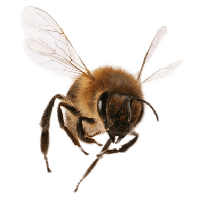

<!-- Header -->

    

        
        <h3 style="font-family:'LDFComicSans'; color: #0FFF50;">
        Welcome to my GitHub profile!!!
        </h3>
    

     
     
    <!-- Repos -->
    

        <h1>
            📌Pinned Repos📌
        </h1>
        <section>
            <h2>
                Bee Image Classification CNN
            </h2>
            

                

                    <h3>
                        <a href="https://github.com/Shaddyjr/bee-image-classifier">Project Repo</a>
                    </h3>
                    

                        
                        

                            I used the dataset from the <a href="https://www.kaggle.com/jenny18/honey-bee-annotated-images">Honey Bee Annotated Image Dataset</a> to train a CNN using various model compositions
                        

                    

                

                

                    <h3>
                        <a href="https://bee-image-classifier.herokuapp.com/">Project Website</a>
                    </h3>
                    

                        
                    

                

            

        </section>
    

    <!-- Footer -->
    <!-- Huge thanks to https://dev.to/ryanlanciaux/visitor-count-on-your-github-profile-with-one-line-of-markdown-593g -->
     
     
<h4 style='color:#0FFF50;;'>You are visitor #</h4>

 
 

<!-- Social -->
<!-- Huge thanks to https://shields.io/ -->

